Project Management
==================

Record of Interactions with Client 
-----------------------------------

2pm meeting with client Notes: 10/7/18

* Needs: no platform currently for catering for customers, bigger clients, corporate clients that spend fair bit of money
* Current process- order what they want as long as couple days notice - as long as sufficiently staffed
* We confirm by email take payment over phone - credit card and then drive the food out to them at a certain time
* Whycatering don’t use online system; head office charge 3% on any orders go through their system
  * No way to utilise it in a way that gives us any notice - if someone wants fifty items going to have to put extra staff on
  * No delivery attached to that
  * Currently they order x amount we will do delivery for free
  * Min quantity -
  * Solution: geographical- log in - if they are within that area free delivery, if outside not free
  * Payment system? Doesn’t mind paying over phone still
  * Biggest befiit wants is allowing people to have multiple logins that other people can use- eg staff can add onto it
  * Or just an id they can type in and see what orders are on that id
* The person that has the login - eg ui insurance - this is your login that you can use- that person can start an order- generates login - goes around - others login and add onto it
* The person initiated order would have to be the one to submit that order at the end - only them
* And something to calculate their distance to check if they are in range or out of range
  * Drive time
* Discount in buying in bulk- meet min thresholds
* If people have modifications - guacamole add ons etc
* <quana@gym.com.au>- use his email address while testing it - text message reminder that you don’t miss it - eg new order come in from x

1pm meeting with client Notes: 16/7/18

* Alex the client came in for lunch to review the proposal for the website
* Agreed that the app would be catered towards large clients
* from his feedback he told us he wanted to be notified whenever a new order would come through either by email or text

Application Design 
===================

Summary of Application
----------------------

**Problem defenition**: there is currently an online ordering system for gyg, however the client tells us there is no way to use this system to offer discounts for larger clients. The current online system also does not allow notice because customers can only choose to order for that day. This is a problem for the client because if a large client places a large order for that day the client has to put more staff on to cater for the higher demand. The client would like a platform where large clients can order three days in advance. This will give our client more notice so that he can add more staff on and gather the necessary resources rather than rushing.

**Problem Solution:** We will be building an online ordering process for GyG Kawana. This system will be targeted towards the larger clients of GYG. Through the app they can place their food orders. This order will then be sent off to our client through email or text. He can then call the company or business who ordered the food and sort payment over the phone. Our client told us he would prefer payment over the phone.

Review of Conceptual Design and Edit Based on Feedback
------------------------------------------------------

The client is happy with the proposal however base don feedback for the problem solution the client also suggested that he would like to be notified by text or email when an incoming order arrives. He also suggested that large clients should be offered a discount on bulk orders from GyG. These proposals were put forward and would become part of the conceptual design of the app.

User Stories for App
--------------------

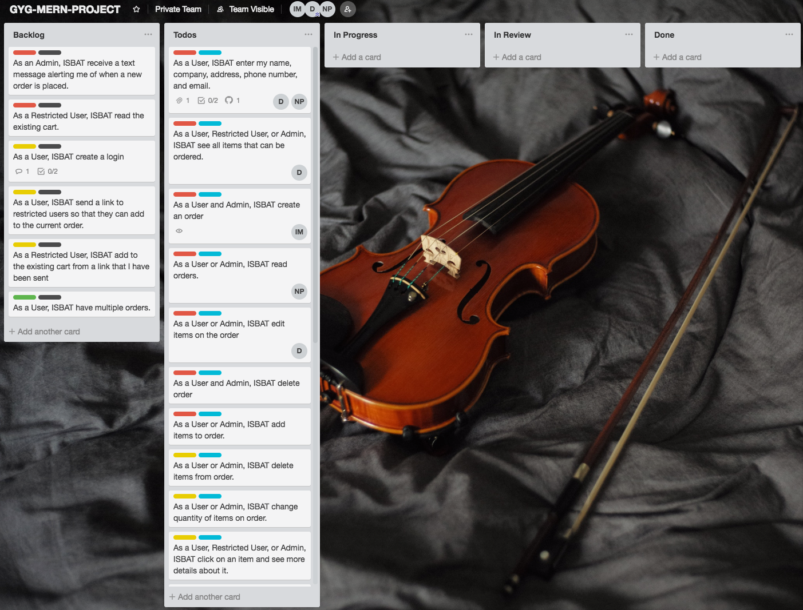

Workflow Diagram
----------------

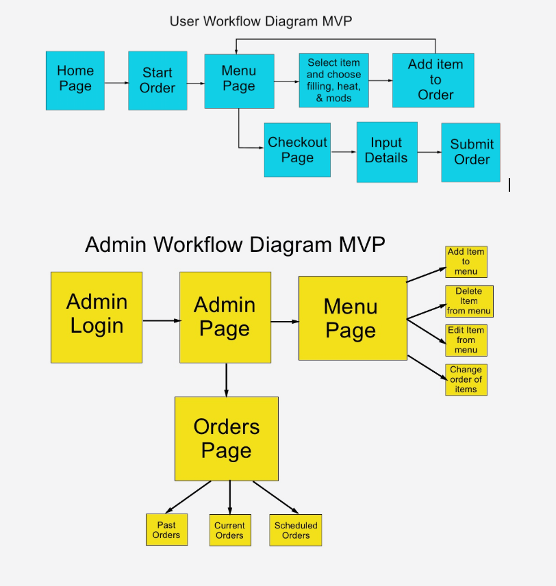

Wireframes
----------

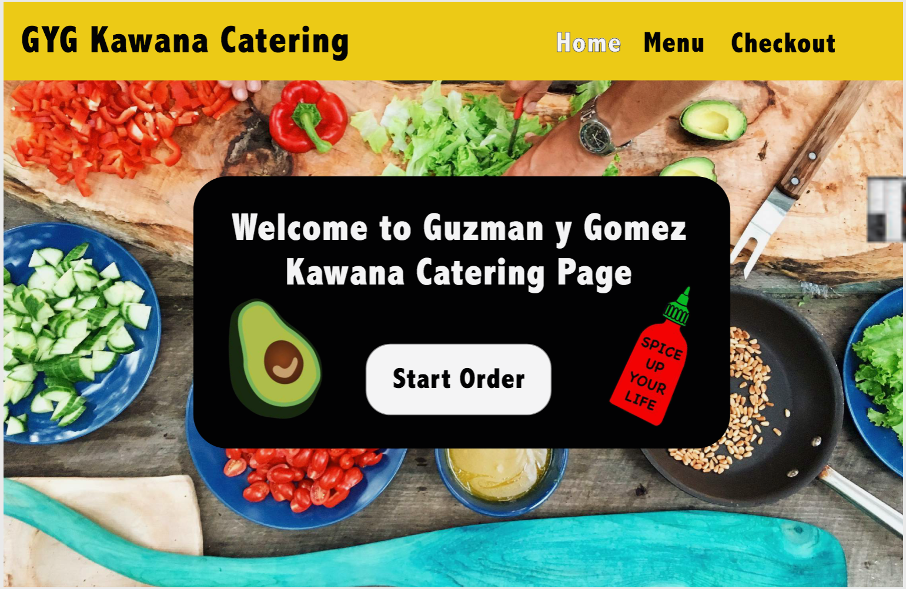

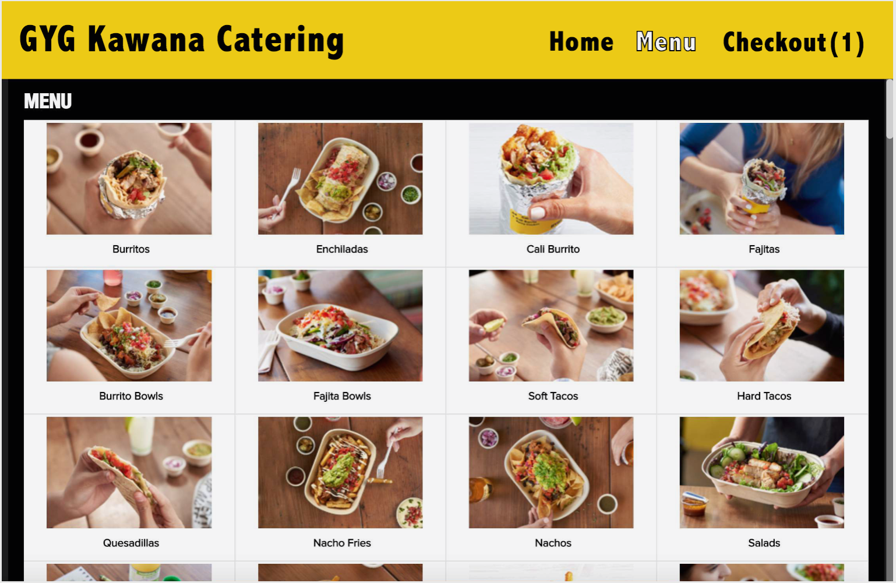

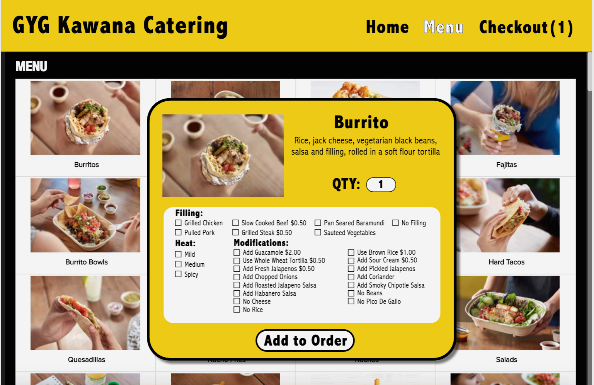

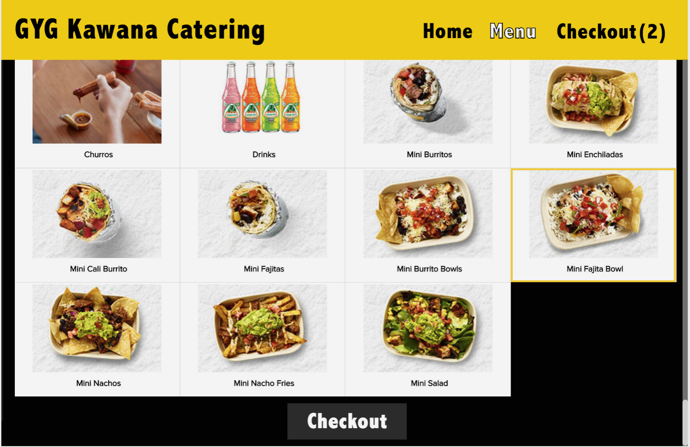

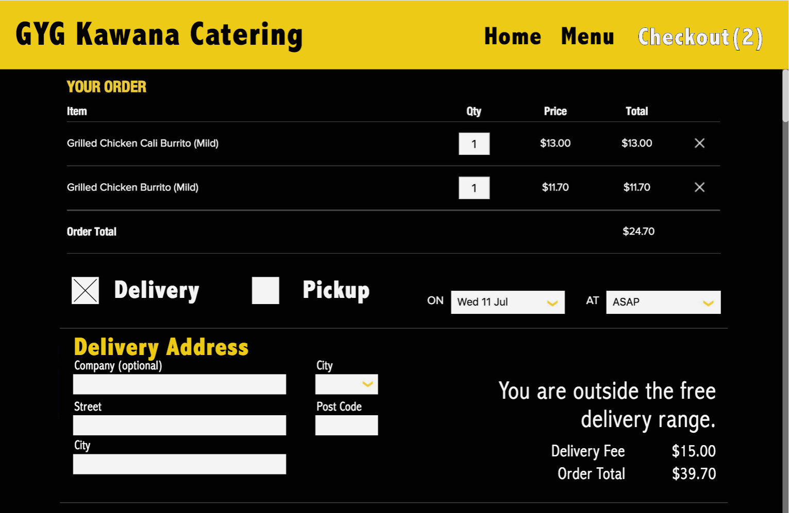

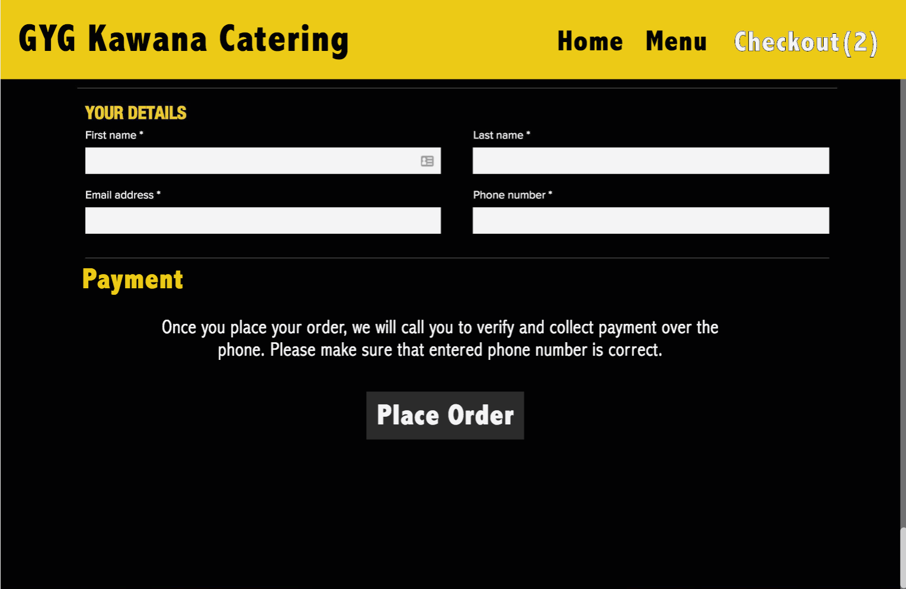

ERD 
---------------------------------
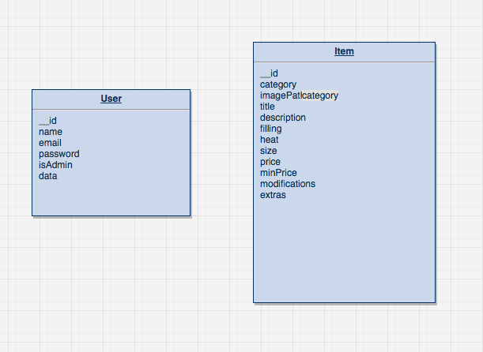

Project Plan and Effort Estimation
---------------------------------

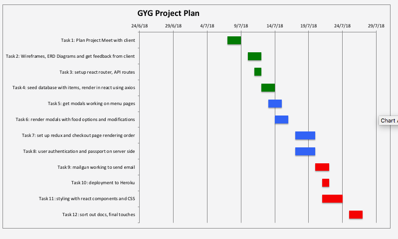

Team Management
---------------

Nic: Front-end development, MenuPage, Redux

Ian: Testing, React Router, Styling, Checkout-Page, API integration

Denis: Back-end development, autheniticaiton, passport, email

Work was monitored with trello. It was useful for monitoring tasks

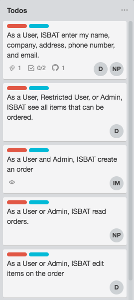

Monitoring Each Others Work
---------------------------

Pull requested were reviewed before merging into master

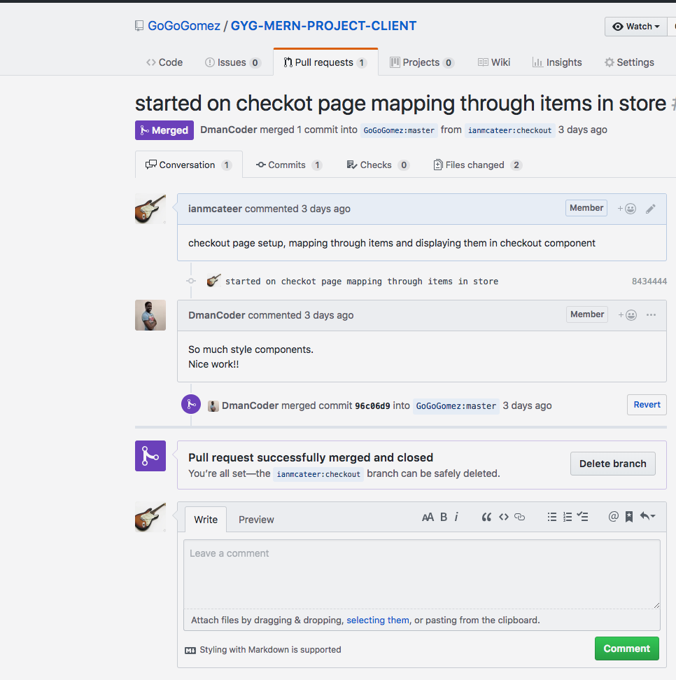

Git Flow
--------

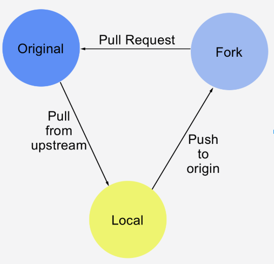

We will be utilising git for our version control. We have setup two github repositories, one for the server-side and one for the client-side. Each of these repo’s have been setup for team collaboration. This was achieved by the repository owner adding collaborators with read and write access for each repository. Each team member will contribute to the project by issuing pull requests. At the end of the day, if we wish, we can send a pull request to the repository owner to merge our code changes. We will be using the fork and pull model where each collaborator forks the repository to create a clone in their own github and then clones this to their local machine. Each time we want to add a new feature we will create a branch. After making the relevant additions to build the new features, we will just commit the new changes and checkout to the git master branch. At this point, we will push the branch to the remote repository. Then we will push the changes using git push [git-remote-alias] [branch-name]. In our forked repository Github page, we will change to the branch with the new feature and then hit the "Pull Request" button. The repository owner can then merge the incoming pull requests. Each pull request will be reviewed by a different team member than the one making the request to assure that it will merge properly.

Cient Satisfaction Questionnaire
--------------------------------

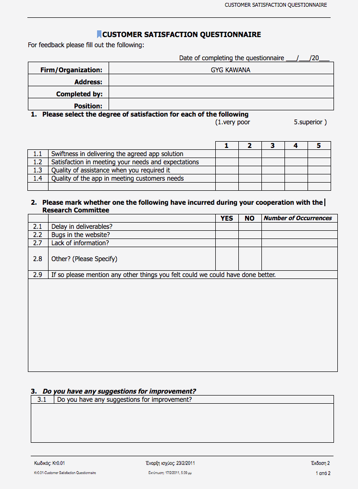

Post-Project Review
-------------------

### Challenges

* Working in a team for a major project comes with challenges in itself. Dividing the project into managebale tasks and delegating those to team members proved difficult because members were more comfortable with some areas than others. We overcame this through using project management strategies such as Trello and the use of agile methodology
* Git flow: sometimes there was a conflict when merging pull requests because people would work on the same section of code. It was difficult to resolve these conflicts at times. This cost time.
* Deployment: Deploying to Heroku proved a challenge. The server file just wasnt deploying. From what i remember this was because one of my enviornment variables was incorrectly named. Took a couple of hours and attempts to finally get it resolved

### Lessons Learned

* Planning is essential:
  * Don’t start writing code until you have a well laid out plan
* Merging without understanding
  * Sometimes merges were made without checking. It’s always important to look at the code before merging into master
* git push —force: don't do it
* Communication is key: There is no substitution for talking to team members. At times we ran into problems and attempted to fix it ourselves whichis fine, but if youre having the same problem for an hour or two its best to talk to a team member or anyone around. They can maybe help you. Or simply even talking about it will help you really understand the problem and the soltuion might suddenly come to you
*

### Project Future

* login capabilities to store and retrieve orders
* enable user to edit items and delete items
* enable user to customise modifications
* enable a secret code for users to enter to reduce their total price

